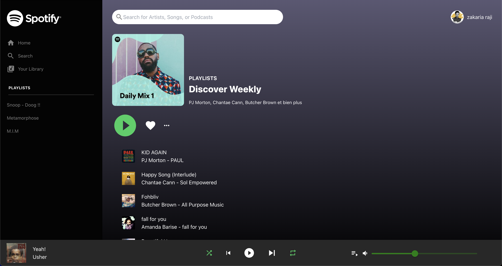

# Spotify Clone

- React JS 18
- Spotify API
- React Context (reducer, dispatcher) VS Prop Drilling
- Custom CSS
- TailwindCSS

- All playlist items are fetched dynamically from the connected user's Spotify account.

## Prop Drilling --> Coupled Code

- Avoiding passing data between components using props is mandatory. Using the Context API, Redux, or any state management library will save us a lot of trouble dealing with data flow throughout the entire app.

## Run App

In the project directory, you can run:

### `npm start`

Runs the app in the development mode.\
Open [http://localhost:3000](http://localhost:3000) to view it in your browser.

The page will reload when you make changes.\
You may also see any lint errors in the console.

## TODO

- Add Actions to the controls buttons
  - Use react context (ex : currently played item/song, isPlaying...)
- Get list of user's top artists
- ...and so on.
